# CoReST: Reproducible Spatial-Domain Identification via Cross-Seed Consensus

[](https://www.python.org/)
[](https://opensource.org/licenses/MIT)

> **CoReST** = **Co**nsensus for **Re**producible **S**patial **T**ranscriptomics — reproducible tissue-domain identification on Visium data, **two honest studies** on one SEDR backbone:
> 1. **Gated multimodal fusion** of UNI histology + gene expression — an honest *negative* (where you fuse matters; image adds no robust gain).
> 2. **Cross-seed consensus** that removes SEDR's random-seed lottery — deterministic, label-free *seed-insurance* **(the current focus)**.
>
> *(Project formerly **GateST**, named after Part 1's **Gate**d fusion. GitHub repo: [`dmarissas/GateST`](https://github.com/dmarissas/GateST).)*

---

## Contents

- [TL;DR — the two studies](#tldr--the-two-studies)
- [Installation](#installation)
- [Data setup](#data-setup)
- **[Part 1 — Gated Multimodal Fusion](#part-1--gated-multimodal-fusion)**
  - [Overview](#overview) · [Pipeline, step by step](#pipeline-step-by-step) · [Results](#part-1-results) · [Why it behaves this way](#why-feature-fusion-hurts-but-graph-fusion-doesnt)
- **[Part 2 — Consensus / Robustness](#part-2--consensus--robustness)**
  - [The gap](#the-gap-the-seed-lottery) · [Method](#method-evidence-accumulation) · [How to run](#how-to-run-part-2) · [Results](#part-2-results) · [DLPFC generalization](#dlpfc-generalization-n4) · [Honest negatives](#honest-negatives--scope)
- [Experiments & Ablations (script reference)](#experiments--ablations)
- [Project structure](#project-structure) · [Reproducibility](#reproducibility) · [Limitations](#limitations--honest-scope) · [Citation](#citation) · [Acknowledgements](#acknowledgements)

---

## TL;DR — the two studies

Both studies use the same backbone — **SEDR** (Spatial Embedding by Deep learning with Regularization, a VAE + GNN) — and are evaluated by **ARI** against a gold standard.

| | **Part 1 — Fusion** | **Part 2 — Consensus** |
|---|---|---|
| **Question** | Does H&E histology help identify tissue domains? | Can we remove SEDR's random-seed lottery? |
| **Answer** | **No** (honest negative) | **Partly** (deterministic *seed-insurance*) |
| **Finding** | *Where* you fuse matters — feature fusion **hurts**, graph fusion **ties** — but UNI histology adds **no robust gain** over genes. | A deterministic cross-seed consensus lifts a typical run by **+0.037** (0.549→0.586), is **label-free**, and ≈ the best-of-pool — but does **not** reliably beat the *best* seed. |
| **Scope** | HBRC breast-cancer section, 20 domains | 4 datasets (1 breast + 3 cortex donors); lift + determinism transfer, variance-reduction & beating-best-seed are **dataset-dependent** |

> **Honesty first.** Every result here is reported with its controls and its failure modes. Negatives are stated plainly; a single lucky number is never the headline (see the [seed-pool replication](#seed-pool-replication) and [N=4 correction](#dlpfc-generalization-n4)).

---

## Installation

```bash
git clone https://github.com/dmarissas/GateST.git
cd GateST
pip install -r requirements.txt
```

**Requirements:** Python 3.9+ · PyTorch 2.0+ · torch-geometric · scanpy · timm · torchstain · scikit-learn · huggingface_hub · (Part 2: `leidenalg` + `igraph`).

> **`SEDR_module.py`** (the encoder/decoder architecture) must be present — it is supplied from the upstream [SEDR repo](https://github.com/JinmiaoChenLab/SEDR). `SEDR_model.py` (the training-loop wrapper) is included.

---

## Data setup

### Part 1 & 2 — HBRC (10x Visium Human Breast Cancer, Block A Section 1)

Download from [10x Genomics](https://www.10xgenomics.com/resources/datasets/human-breast-cancer-block-a-section-1-1-standard-1-1-0):
- **Filtered feature-barcode matrix** `V1_Breast_Cancer_Block_A_Section_1_filtered_feature_bc_matrix.h5`
- **High-resolution tissue image** `V1_Breast_Cancer_Block_A_Section_1_image.tif`
- **Spatial imaging data (.tar.gz)** — extract to get the `spatial/` folder (`tissue_positions_list.csv`, `scalefactors_json.json`).

**Gold standard:** `metadata.tsv` (20 fine-grained domains) from [JinmiaoChenLab/SEDR_analyses → data/BRCA1/metadata.tsv](https://github.com/JinmiaoChenLab/SEDR_analyses/blob/master/data/BRCA1/metadata.tsv) (originally [Xu et al. 2022](https://doi.org/10.1038/s41592-022-01494-7)).

```
data/block_a_section1_v110/
├── V1_Breast_Cancer_Block_A_Section_1_filtered_feature_bc_matrix.h5
├── V1_Breast_Cancer_Block_A_Section_1_image.tif
├── metadata.tsv
└── spatial/{tissue_positions_list.csv, scalefactors_json.json}
```

**UNI model:** requires HuggingFace access approval — request at [MahmoodLab/uni](https://huggingface.co/MahmoodLab/uni).

### Part 2 — DLPFC (generalization test, gene-only)

Three cortex sections, one per donor, from the [*Visium DLPFC (preprocessed)*](https://figshare.com/articles/dataset/Visium_DLPFC_preprocessed/22004273) Figshare dataset (CC BY 4.0; [Maynard et al. 2021](https://www.nature.com/articles/s41593-020-00787-0) / spatialLIBD). Each is a self-contained `.h5ad` (counts + `obsm['spatial']` + layer labels in `obs['sce.layer_guess']`). Place each at `data/dlpfc_<id>/<id>.h5ad`:

```
data/dlpfc_151673/151673.h5ad      # donor 3, k=7 layers
data/dlpfc_151507/151507.h5ad      # donor 1, k=7 layers
data/dlpfc_151669/151669.h5ad      # donor 2, k=5 (lacks superficial Layers 1–2)
```

> `data/` is gitignored. The figures committed under `figures/` are copies of each run's output (the live output path is `data/<dataset>/figures/`).

---

# Part 1 — Gated Multimodal Fusion

> **Question:** spatial-domain methods usually use gene expression alone. Can H&E histology — encoded by the **UNI** pathology foundation model — add signal through a learned *gate*?

## Overview

Part 1 fuses two modalities and asks **where** fusion should happen:

- **Gene features** — 200d PCA from 2000 highly-variable genes (standard SEDR preprocessing).
- **Histology features** — multi-scale UNI embeddings (3×1024d → 256d PCA) from H&E patches.

It compares two gate locations:
- **(A) Feature-space gate** — mix the modalities *before* SEDR (per-spot scalar gate).
- **(B) Graph-level gate** — let histology reshape SEDR's spatial *graph edges*, keeping node features pure-gene.

**The target** we are trying to recover (20 fine-grained domains, the gold standard):

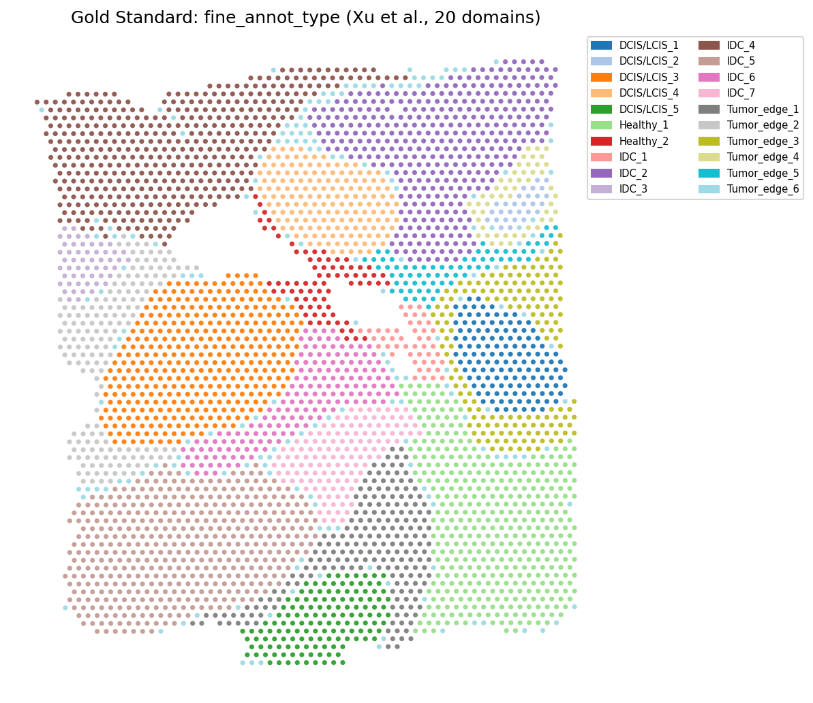
*The 20 annotated tissue domains in space — the ground truth ARI is measured against.*

## Pipeline, step by step

The five stages are **strictly sequential** — each consumes files written by the previous one. Run from the repo root.

### Step 1 — Gene features
```bash
python gene_features.py          # ~2 min
```
Visium `.h5` → 2000 HVGs → **200d gene PCA**; also writes spatial coordinates and the aligned gold labels (coarse 4-class + fine 20-class).

### Step 2 — Image features
```bash
python image_features.py         # ~15 min, GPU + HuggingFace login
```
H&E `.tif` → per-spot patches at **3 scales** (1×, 2×, 3×) → Macenko stain-normalize → UNI (3×1024d) → **256d PCA**. (Also saves `image_features_raw3072.npy` for the feature-representation study.)

### Step 3 — Feature variants + the gate
```bash
python prepare_features.py       # ~5 min
```
Aligns both modalities by barcode and builds **4 variants**: `gene_only` (200d), `image_only` (256d), `concat_fused` (456d, naïve), `gated_fused` (learned feature-space gate). The gate network (deterministic, `seed=42`):

```python
g = sigmoid(W_gate · concat([gene, image]))     # per-spot gate in (0,1)
h_fused = g · h_gene + (1 − g) · h_image
loss    = recon_gene + 0.5·recon_image − 0.3·entropy(g)   # entropy term fights gate collapse
```

### Step 4 — SEDR training + evaluation
```bash
python train_sedr.py             # ~10–12 min
```
Trains SEDR for **5 conditions** — the 4 feature variants on the spatial graph, plus `gene_imagegraph` (pure-gene features on the **image-gated** graph) — across **5 seeds**, evaluated with **{KMeans, GMM} × {raw, refined}**. → `results/ari_results.csv`.

### Step 4b — Cluster regeneration *(required before Step 5)*
```bash
python cluster_regeneration.py   # ~1 min
```
`train_sedr.py` saves only embeddings + ARI; this re-clusters them into the `clusters_<cond>_{k20,k4}.npy` files the figures read.

### Step 5 — Visualization
```bash
python visualize.py              # ~5 min
```
Produces the figures below (bar chart, comparison map, spatial clusters, t-SNE).

## Part 1 Results

Fine-grained ARI (k=20), SEDR latent + spatial refinement, mean over 5 seeds. **Both clusterers are shown because the gene-vs-graph ranking flips between them.**

| Condition (features → graph) | KMeans (refined) | GMM (refined) |
|---|---|---|
| Image only → spatial | 0.2745 | 0.3019 |
| Concat fusion → spatial | 0.4687 | 0.5224 |
| Feature gate → spatial | 0.5107 | 0.5363 |
| Gene only → spatial | 0.5237 | **0.5746** |
| **Gene → image-gated graph** | **0.5459** | 0.5711 |

*Published single-run baselines (pipeline/refinement unknown, for rough context only): SEDR 0.3668 · Seurat 0.4612 · STAGATE 0.4944 · TGR-NMF 0.5286.*

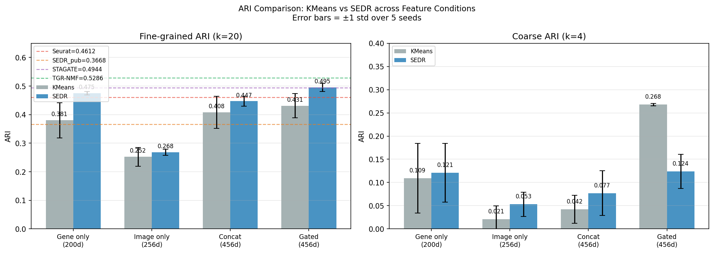
*KMeans vs SEDR ARI across conditions — note the gene-vs-graph ranking flips between KMeans and GMM, which is why we report both.*

**Reading the table honestly:**
- **Feature fusion (concat, feature-gate) stays below gene-only under *both* clusterers** — fusing in the feature space hurts. Robust.
- **The image-gated graph *ties* gene-only** — it wins under KMeans (+0.022) but is marginally behind under the stronger GMM (−0.004, within seed noise). So histology gives **no robust ARI gain**.

**Predicted domains vs gold standard** (image-gated-graph condition):

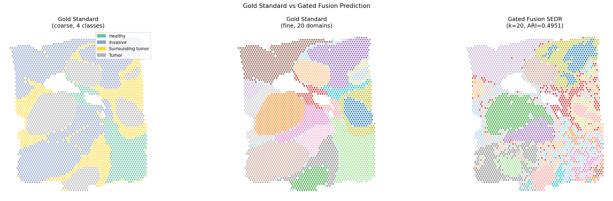

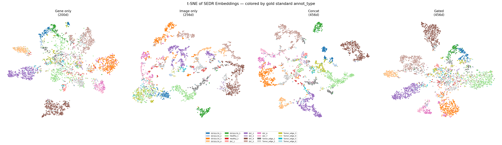
*t-SNE of the SEDR embedding colored by gold standard (20 domains).*

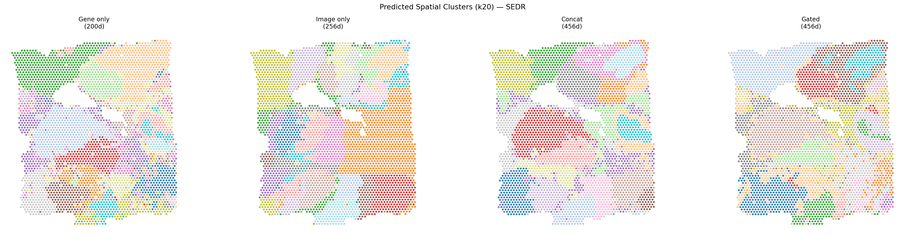
*Predicted spatial clusters across all conditions.*

### Control: is the KMeans-level effect real?

Gene features fixed; only the graph changes. These confirm the (KMeans-only) effect is genuine image *content*, not graph sparsity:

| Control | fine ARI (KMeans, refined) | reading |
|---|---|---|
| Image-gated graph (intersect) | 0.5459 | the effect |
| Density-matched spatial graph (k=3, equal sparsity) | 0.5178 | rules out "just fewer edges" |
| Shuffled-image graph | silhouette 0.237 (vs 0.288) | rules out artifact; image content matters |

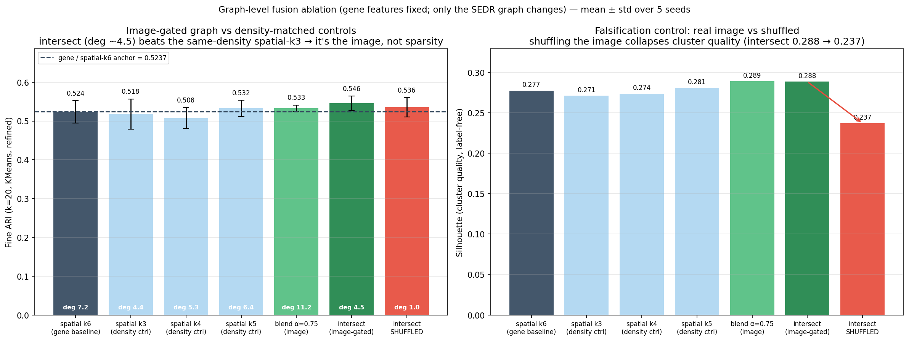
*Graph-fusion modes + controls. The `intersect` edge beats the same-density spatial graph (image content helps under KMeans) — but the effect does not survive GMM.*

### Is the bottleneck the features or the modality?

Image-only fine ARI across representations of the raw UNI embeddings (GMM, refined):

| Image representation | GMM (refined) |
|---|---|
| all scales, PCA 256 (baseline) | 0.3143 |
| all scales, PCA 512 | 0.3340 |
| scale 1 (1×, cellular) | 0.2949 |
| scale 2 (2×) | 0.3061 |
| **scale 3 (3×, tissue-context)** | **0.3363** |
| *(gene-only ceiling)* | *0.5746* |

Every representation caps at **~0.30–0.34** — a ~0.24 gap below gene-only that no extraction choice closes. **The bottleneck is the modality, not the pipeline.**

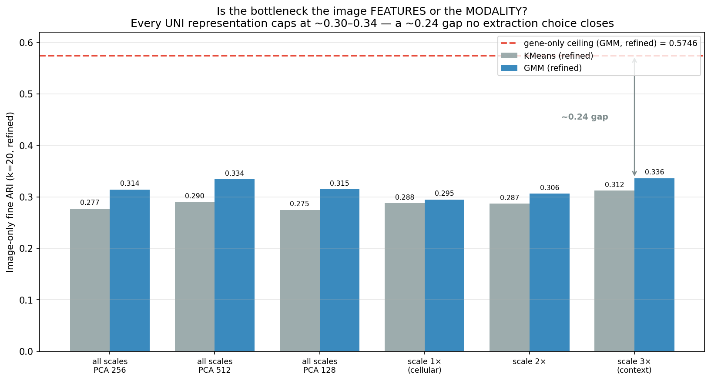
*Image-only ARI never approaches the gene-only ceiling, regardless of PCA size or scale.*

## Why feature fusion hurts but graph fusion doesn't

```
                                   KMeans   GMM
Image only   → spatial graph:      0.2745   0.3019   ← weak on its own
Concat        → spatial graph:     0.4687   0.5224   ← gluing features HURTS
Feature gate  → spatial graph:     0.5107   0.5363   ← still < gene-only
Gene only     → spatial graph:     0.5237   0.5746   ← strong baseline
Gene          → image-gated graph: 0.5459   0.5711   ← ties gene-only (wins KMeans, loses GMM)
```

SEDR's reconstruction loss (`rec_w=10`) dominates training. Putting image *features* into the input forces SEDR to reconstruct 256 noisy image dims, **diluting genes** (concat / feature-gate fall below gene-only). Putting image into the **graph** leaves the reconstruction target pure-gene and only changes message passing — so it does **no harm** and matches gene-only. But the extra morphological signal isn't strong enough to *beat* genes once a capable clusterer (GMM) is used.

> **Honest bottom line (Part 1):** on this section, UNI histology provides **no robust improvement** over gene expression, regardless of fusion strategy or clusterer. The contribution is the methodological lesson (*where* you fuse matters) plus a controlled negative on image utility.

---

# Part 2 — Consensus / Robustness

> **Different question.** Part 1 asked *"can histology help?"* (no). Part 2 asks: *can we remove SEDR's random-seed lottery and get one reproducible answer that is reliably as good as the best single run?*

## The gap (the seed lottery)

SEDR is **seed-sensitive** — same model, same data, fine ARI swings ~0.06 across seeds (gene-only, GMM, refined):

| Seed | 42 | 123 | 456 | 789 | 1234 |
|---|---|---|---|---|---|
| ARI | 0.6052 | 0.5684 | 0.5819 | 0.5429 | 0.5743 |

A practitioner who runs **once** gets a random draw — with no label-free way to know if it was a good seed.

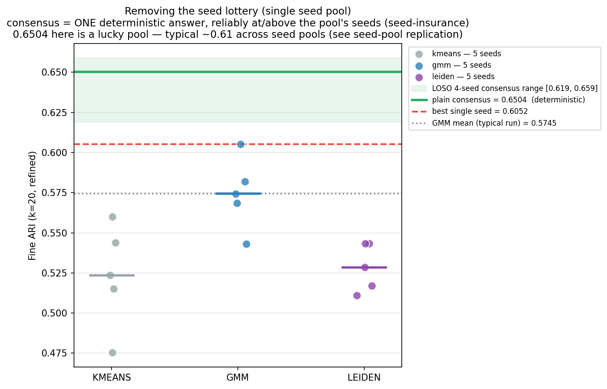
*Each dot is one single-seed run (the lottery); the green line is the single deterministic consensus answer. It lands at/above the best single seed and is reproducible.*

## Method (evidence accumulation)

Base partitions = **5 seeds × {KMeans, GMM, Leiden}** of the gene-only SEDR embedding (32d; **no histology**) → 15 partitions → a **co-association matrix** `C` (how often each spot-pair is grouped together) → deterministic **average-linkage** cut at k=gold. Averaging *agreements* is valid where averaging *embeddings* is not (each seed's latent axes are arbitrary; co-grouping is frame-invariant). This is **evidence-accumulation clustering** (Fred & Jain 2005) — *applied*, not reinvented. Files: `consensus_func.py` (pure functions + self-test), `run_consensus.py` (driver).

## How to run (Part 2)

```bash
# HBRC (default); ~6 min first run, ~1 min on reruns (per-seed embeddings cached)
python run_consensus.py                 # base partitions, variants, robustness, ablations, stability map
python consensus_robustness.py          # the definitive 20-seed study (60 random 5-seed pools)
python visualize_consensus.py           # consensus_vs_lottery / consensus_gain / consensus_spatial
python visualize_robustness.py          # consensus_robustness.png
```
The consensus math has a standalone, GPU-free self-test: `python consensus_func.py`. To run on another dataset, see [Running on another dataset](#running-on-another-dataset-dlpfc-generalization).

## Part 2 Results

### Where the gain comes from (ablations)

The decomposition is anchored on the **best single clusterer per dataset** (GMM on HBRC) — not a fixed clusterer — so the lift isn't inflated by a weak baseline.

| Source | ARI | adds |
|---|---|---|
| Ward agglomerative on one embedding (clusterer alone) | 0.5518 | nothing special (≈ a single run) |
| Typical single run (best-clusterer mean) | 0.5745 | — |
| Cross-method only (1 seed, 3 styles) | 0.5843 | +0.010 |
| **Cross-seed only (5 seeds)** | **0.6294** | **the primary driver** |
| Full plain consensus | 0.6504 | the rest |

**Cross-seed pooling is the driver.** An identity check (B=1 consensus = the input, ARI 1.0) confirms the gain comes from *pooling*, not the clusterer.

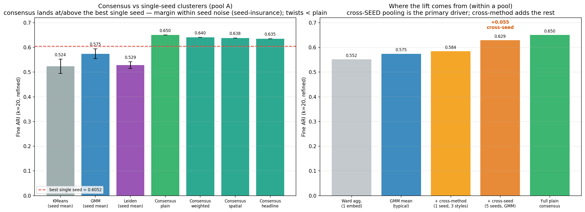
*Left: consensus variants vs single-seed clusterers. Right: the source-of-gain decomposition — cross-seed pooling carries the lift; the "twists" do not beat plain consensus (honest negative).*

### The definitive 20-seed robustness study

Scaled to **20 seeds**, sampling **60 random 5-seed pools** — the two outcomes a practitioner faces:

| Outcome | mean ARI | std | range |
|---|---|---|---|
| **"run once"** (single seed, n=20) | 0.5486 | 0.0327 | 0.481–0.605 |
| **"run 5 + consensus"** (n=60 pools) | 0.5858 | 0.0234 | 0.505–0.641 |

- **Lift over a typical run: +0.037**; across-pool variance reduced **~1.4×**; **deterministic** (within-pool std 0).
- **But consensus does NOT reliably beat the pool's best single seed** — only **29/60 pools (48%, sign-test p=0.65)**. It **matches** best-of-pool, doesn't exceed it.

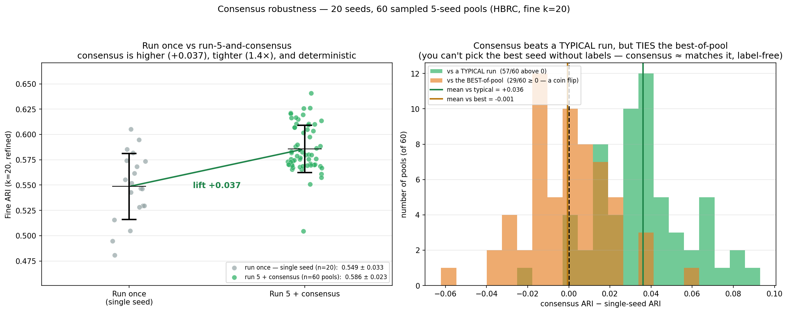
*Run-once vs run-5+consensus, across 60 pools. Consensus tightens the distribution and lifts the typical run — but sits at, not above, the best single seed.*

### Per-spot stability (label-free)

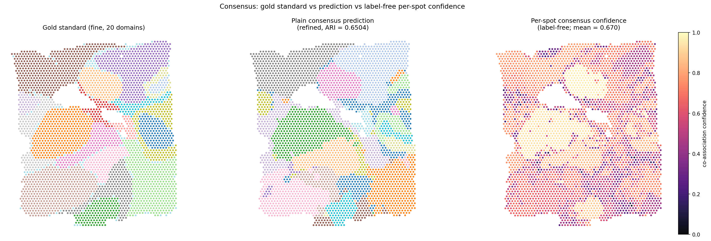
*Gold standard · plain-consensus prediction · per-spot consensus confidence — the confidence map needs no gold labels.*

### Seed-pool replication

Retraining on a **disjoint** set of seeds (`consensus_seed_replication.py`) revealed the original headline was a lucky draw:

| Pool | seeds | consensus ARI | best single seed |
|---|---|---|---|
| A (original) | 42,123,456,789,1234 | 0.6504 | 0.6052 |
| B (independent) | 7,88,314,2024,51966 | 0.6202 | 0.5852 |
| A+B (10 seeds) | all ten | 0.6132 | 0.6052 |

**0.6504 was a 98th-percentile lucky pool** — enumerating all 252 five-seed subsets gives mean 0.6059 ± 0.024. The honest point estimate is the 10-seed **0.6132**. *More seeds ≠ higher ARI* — they give a more honest, lower-variance estimate. **Never pick the seed pool that maximizes the reported number.**

## DLPFC generalization (N=4)

We applied the **identical, untuned** pipeline to **3 DLPFC cortex sections, one per donor** (cross-donor, not near-replicate adjacent slices) — only *k* changes, auto-derived from the gold standard (7 layers for 151673/151507; **5 for 151669**, which lacks the superficial layers).

```bash
python prepare_dlpfc.py        --dataset dlpfc_151673    # then 151507, 151669
python consensus_robustness.py --base-dir data/dlpfc_151673 --label-col layer_guess
python visualize_generalization.py                        # → generalization_across_datasets.png
```

| Dataset (donor) | k | single run | run-5 + consensus | lift | variance | vs best-of-pool |
|---|---|---|---|---|---|---|
| HBRC breast | 20 | 0.549 ± 0.033 | 0.586 ± 0.023 | +0.037 | **1.4× tighter** | ties (29/60) |
| DLPFC 151673 (D3) | 7 | 0.550 ± 0.023 | 0.618 ± 0.039 | **+0.068** | 0.59× wider | **beats (50/60)** |
| DLPFC 151507 (D1) | 7 | 0.477 ± 0.053 | 0.511 ± 0.009 | +0.034 | **6.2× tighter** | below (11/60) |
| DLPFC 151669 (D2) | 5 | 0.363 ± 0.051 | 0.370 ± 0.085 | +0.007 | 0.61× wider | below (8/60) |

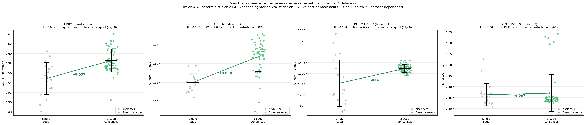
*One panel per dataset: single-seed cloud → deterministic consensus. Lift + determinism hold everywhere; variance and beating-the-best-seed do not.*

**Scorecard (4 datasets):** lift > 0 on **4/4** (but +0.007 → +0.068) · deterministic **4/4** · variance tighter **2/4**, wider **2/4** · beats best-of-pool **1/4** (151673), ties 1/4, below 2/4.

- **What generalizes:** **determinism** + a **non-negative lift** over a typical single run (margin can shrink to +0.007 on the low-signal k=5 section).
- **What does NOT:** **variance reduction** (tighter 2/4, wider 2/4 — the wider sections' tail is *intrinsic*, not a fixable bug) and **beating the best seed** (only 151673).
- **The N=4 correction (honesty in action):** at N=2, DLPFC 151673 made *"consensus beats the best seed on brain tissue"* look like a finding. Two more cross-donor sections **exposed that as 151673-specific**. Expanding the test **shrank the claim** — exactly as it should.

> **Honest cross-tissue claim:** what transfers is **deterministic, label-free, at-least-typical performance** (*seed-insurance*) — not a guaranteed variance reduction and not beating the luckiest seed. A **reproducibility study, not a SOTA ARI claim** (numbers are internal, untuned, refinement applied to all conditions; don't compare to per-dataset-tuned published numbers).

## Honest negatives & scope

- **0.6504 does not replicate** — 98th-percentile lucky pool; honest estimate ~0.61.
- **Consensus does not reliably beat the *best* seed** (≈ coin flip at 20 seeds).
- **The "twist" variants (spatial, quality-weight) all score *below* plain consensus** — the pre-registered novelty **failed**.
- The **label-free variant selector picked the *worst*** variant — reported as a negative.
- The pre-registered **"≥5× variance collapse" criterion was missed**.
- It is an **application** of evidence-accumulation clustering, **not** a new algorithm. Stress-tested by two adversarial workflows + a 20-seed study + a 4-dataset generalization test; each shrank the claim and it stayed honest.

---

## Experiments & Ablations

All scripts run in the project's conda environment after Steps 1–3 have populated `processed/`. Each reads/writes under `data/<dataset>/{results,figures}`.

| Script | What it does | Key output |
|---|---|---|
| `train_sedr.py` | Main comparison: 5 conditions × {KMeans,GMM} × {raw,refined} × 5 seeds | `ari_results.csv` |
| `cluster_regeneration.py` | Re-cluster saved embeddings (required before `visualize.py`) | `clusters_<cond>_*.npy` |
| `experiment_graph.py` | Image-gated-graph modes + controls (density-matched, shuffled-image, paired per-seed) | `graph_experiment_ari.csv` |
| `image_feature_study.py` | Image-only ARI by representation (PCA 128/256/512; scales 1×/2×/3×) | `image_feature_study.csv` |
| `visualize.py` / `visualize_ablations.py` | Part 1 figures | `figures/*.png` |
| `consensus_func.py` | Pure co-association / consensus / stability functions (+ self-test) | — |
| `run_consensus.py` | Consensus driver (variants, robustness, ablations, stability map) | `consensus_ari.csv`, `stability_consensus.npy` |
| `consensus_seed_replication.py` | Disjoint seed-pool ablation (HBRC only) — exposed the lucky pool | `consensus_seed_replication.csv` |
| `consensus_robustness.py` | The definitive 20-seed study (60 pools, lift / variance / sign test) | `consensus_robustness.csv` |
| `visualize_consensus.py` / `visualize_robustness.py` | Part 2 figures | `figures/*.png` |
| `prepare_dlpfc.py` | DLPFC `.h5ad` → `processed/` (gene-only, layer labels, auto-k) | `processed/*` |
| `visualize_generalization.py` | Cross-dataset figure (one panel per dataset, 3-way verdict) | `generalization_across_datasets.png` |

### Running on another dataset (DLPFC generalization)

The Part-2 scripts are **dataset-agnostic** — pass `--base-dir` (the `data/<dataset>/` folder) and `--label-col` (the gold-label column). **Nothing is tuned; only k changes**, auto-derived from the gold standard. HBRC is the default for every script.

| Script | Flags | Default |
|---|---|---|
| `prepare_dlpfc.py` | `--dataset <folder>` | `dlpfc_151673` |
| `run_consensus.py` / `consensus_robustness.py` | `--base-dir`, `--label-col` | HBRC, fine labels |
| `visualize_consensus.py` / `visualize_robustness.py` | `--base-dir`, `--label-col` | HBRC, `fine_annot_type` |
| `consensus_seed_replication.py` | *(none — HBRC only)* | HBRC |
| `visualize_generalization.py` | *(none — reads every dataset's `results/`)* | all datasets |

```bash
# full per-section workflow (repeat for dlpfc_151507, dlpfc_151669)
python prepare_dlpfc.py        --dataset dlpfc_151673
python run_consensus.py        --base-dir data/dlpfc_151673 --label-col layer_guess
python consensus_robustness.py --base-dir data/dlpfc_151673 --label-col layer_guess
python visualize_consensus.py  --base-dir data/dlpfc_151673 --label-col layer_guess
python visualize_robustness.py --base-dir data/dlpfc_151673 --label-col layer_guess
python visualize_generalization.py    # cross-tissue figure (needs results/ for every dataset)
```

---

## Project Structure

```
GateST/
├── gene_features.py            # Part 1 · Step 1: gene PCA + labels + coords
├── image_features.py           # Part 1 · Step 2: multi-scale UNI embedding
├── prepare_features.py         # Part 1 · Step 3: gated fusion + feature variants
├── train_sedr.py               # Part 1 · Step 4: SEDR training + ARI eval (incl. image-gated graph)
├── cluster_regeneration.py     # Part 1 · Step 4b: regenerate cluster files (required for Step 5)
├── visualize.py                # Part 1 · Step 5: figures
├── experiment_graph.py         # Part 1 ablation: image-gated-graph modes + controls
├── image_feature_study.py      # Part 1 ablation: image-only ARI by representation
├── visualize_ablations.py      # Part 1 ablation figures
├── consensus_func.py           # Part 2: pure co-association / consensus / stability (+ self-test)
├── run_consensus.py            # Part 2: consensus driver
├── consensus_seed_replication.py  # Part 2: disjoint seed-pool ablation (HBRC)
├── consensus_robustness.py     # Part 2: 20-seed robustness study
├── visualize_consensus.py      # Part 2 figures (lottery, gain, spatial/stability)
├── visualize_robustness.py     # Part 2 figure (run-once vs consensus clouds)
├── prepare_dlpfc.py            # Part 2 generalization: DLPFC .h5ad → processed/
├── visualize_generalization.py # Part 2 generalization: cross-dataset figure
├── SEDR_model.py · SEDR_module.py · graph_func.py · utils_func.py   # SEDR backbone + helpers
├── figures/                    # committed copies of key figures (this README cites these)
├── requirements.txt · README.md
```

---

## Reproducibility

- Gate network: `torch.manual_seed(42)` in `prepare_features.py` — gated features produced once, deterministically.
- SEDR evaluation: 5 seeds `[42, 123, 456, 789, 1234]`, mean ± std (20 seeds for the Part-2 robustness study).
- The consensus is **deterministic** — given the cached embeddings it returns one fixed answer (rerun std 0).

---

## Limitations & honest scope

- **Part 1 is a single section.** Findings (feature fusion hurts, graph fusion ties, no robust image gain) are HBRC-only and may differ where morphology is more domain-discriminative.
- **Part 1 is a negative/methods result, not SOTA.** The fusion study does not beat gene-only by adding histology.
- **Clusterer dependence.** The image-gated graph's edge appears under KMeans but not GMM; we report both and conclude a tie.
- **One foundation model.** Only UNI tested; the ~0.24 ARI gap makes a reversal from a different encoder unlikely.
- **Part 2 is an application, generalization is partial.** 4 datasets (1 breast + 3 cortex donors), 20 seeds, no formal significance test on within-dataset gaps. Variance-reduction and beating-the-best-seed are **dataset-dependent**; only determinism + at-least-typical lift transfer. Next step: broader **tissue diversity** beyond breast + cortex.

---

## Citation

```bibtex
@misc{CoReST2026,
  author = {Delfina Amarissa Sumanang, Frederick Halim, Lui Kirtan, Cheng-Hsi Cheng, Lien-Yun Yang},
  title  = {CoReST: Reproducible Spatial-Domain Identification via Cross-Seed Consensus},
  year   = {2026},
  url    = {https://github.com/dmarissas/GateST}
}
```

---

## Acknowledgements

- [SEDR](https://github.com/JinmiaoChenLab/SEDR) — base spatial GNN model (Li et al.)
- [UNI](https://huggingface.co/MahmoodLab/uni) — pathology foundation model (Chen et al., 2024)
- [Xu et al. 2022](https://doi.org/10.1038/s41592-022-01494-7) — HBRC gold standard annotations
- [Maynard et al. 2021](https://www.nature.com/articles/s41593-020-00787-0) — DLPFC dataset & cortical-layer annotations (*Nat. Neurosci.*); sections `151673`, `151507`, `151669` from the preprocessed [Visium DLPFC on Figshare](https://figshare.com/articles/dataset/Visium_DLPFC_preprocessed/22004273) (CC BY 4.0)
- [TGR-NMF](https://academic.oup.com/bib/article/26/1/bbae707/7945615) — published baseline (Li et al., 2024)
- [Brussee et al. 2024](https://arxiv.org/abs/2406.12808) — GNN in histopathology review
